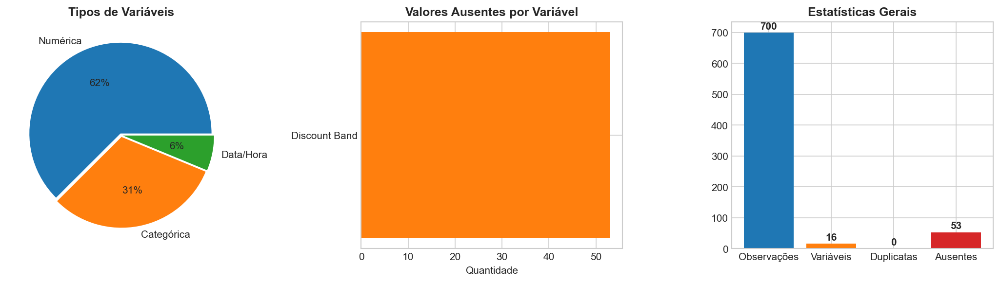
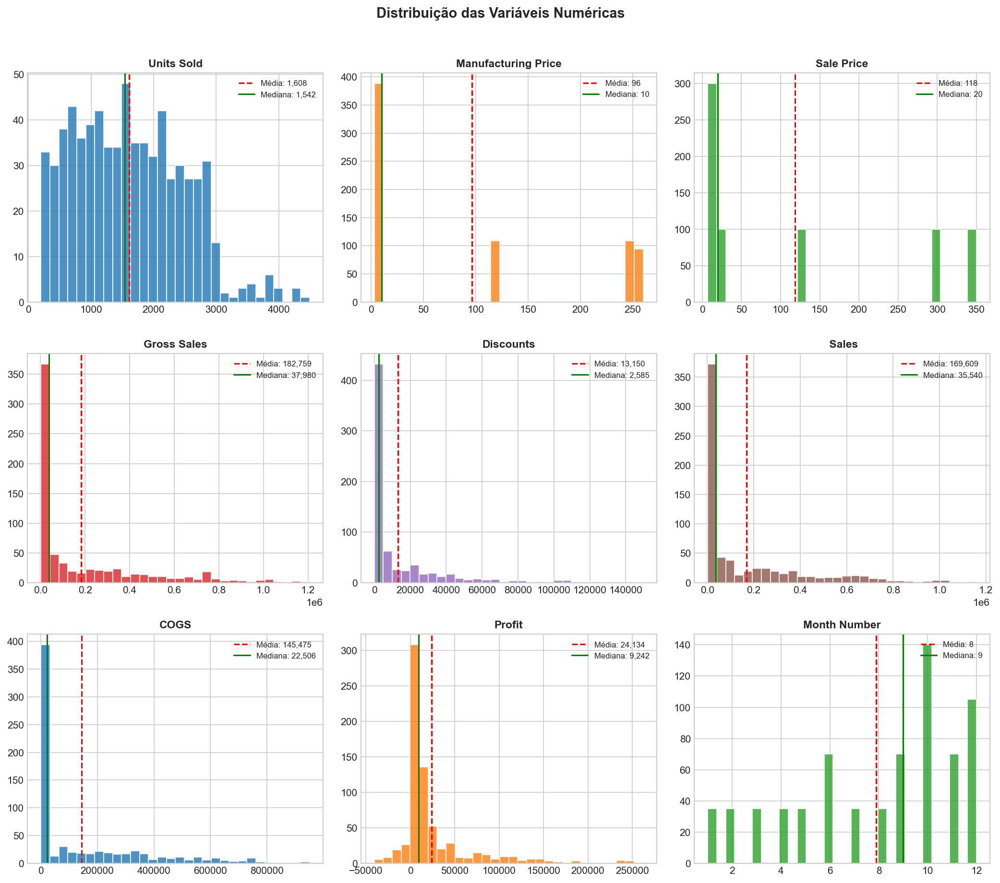
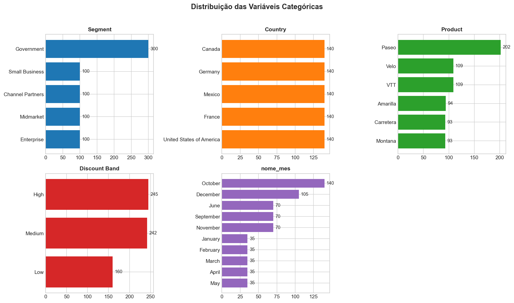
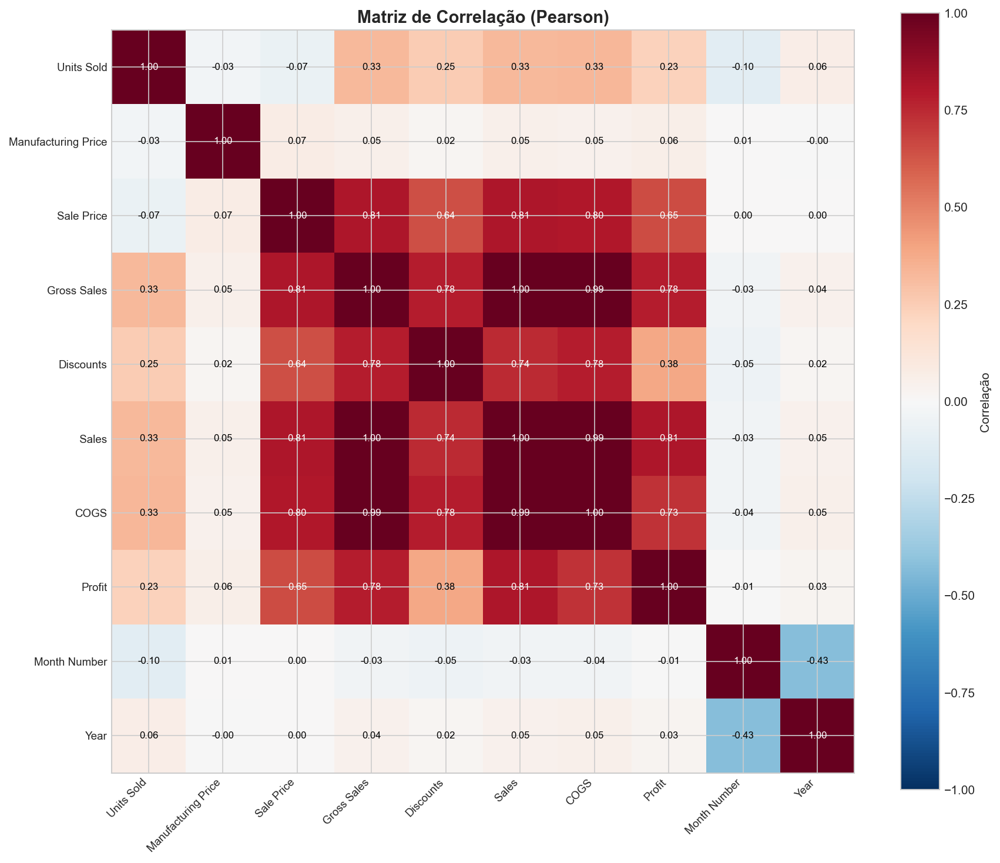
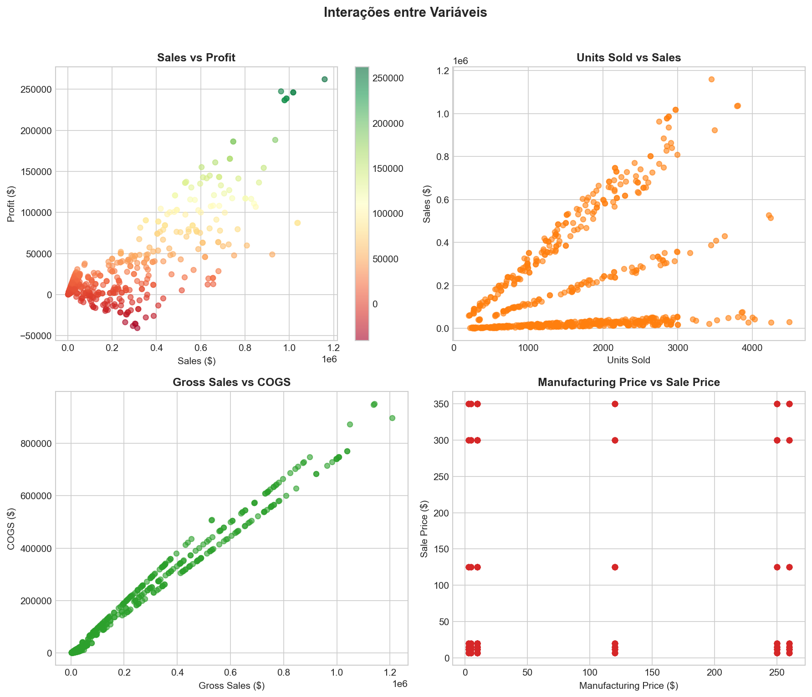
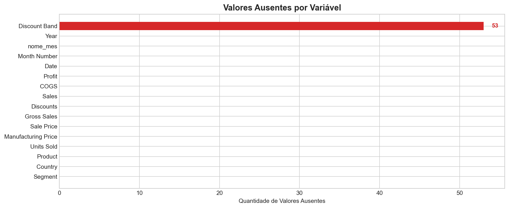
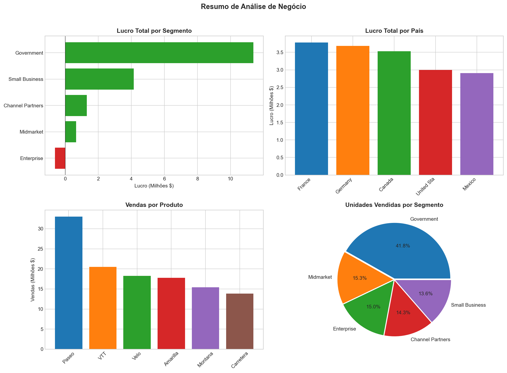

# 📊 Análise Exploratória de Dados com YData Profiling

<div align="center">


**Análise Exploratória de Dados automatizada utilizando YData Profiling**  
*Dataset: Vendas e Lucros por Segmento, País e Produto*

[📈 Resultados](#-resultados) • [🔍 Alertas](#-alertas-detectados) • [📋 Dataset](#-sobre-o-dataset) • [🚀 Como Usar](#-como-executar)

</div>

---

## 📋 Sobre o Projeto

Este projeto demonstra o poder da **Análise Exploratória de Dados (EDA) automatizada** utilizando a biblioteca **YData Profiling** (anteriormente conhecida como Pandas Profiling). 

A análise foi realizada com **configurações padrão** - sem customizações ou filtros específicos - demonstrando o que a ferramenta oferece "out of the box" para uma análise completa de dados.

### 🎯 Objetivo

Gerar um relatório completo e automatizado de EDA que inclui:
- Estatísticas descritivas de todas as variáveis
- Análise de valores ausentes
- Correlações entre variáveis
- Distribuições e histogramas
- Detecção automática de alertas

---

## 📋 Sobre o Dataset

| Métrica | Valor |
|---------|-------|
| **Observações** | 700 registros |
| **Variáveis** | 16 colunas |
| **Valores Ausentes** | 53 (0.5%) |
| **Linhas Duplicadas** | 0 (0%) |
| **Memória** | 252.6 KB |

### Tipos de Variáveis

| Tipo | Quantidade |
|------|------------|
| Numérica (float64) | 6 |
| Categórica (object) | 5 |
| Numérica (int64) | 4 |
| Data/Hora | 1 |

### Colunas do Dataset

| Variável | Tipo | Descrição |
|----------|------|-----------|
| Segment | Categórica | Segmento de mercado (Government, Enterprise, etc.) |
| Country | Categórica | País da venda |
| Product | Categórica | Nome do produto |
| Discount Band | Categórica | Faixa de desconto aplicada |
| Units Sold | Numérica | Unidades vendidas |
| Manufacturing Price | Numérica | Preço de fabricação |
| Sale Price | Numérica | Preço de venda |
| Gross Sales | Numérica | Vendas brutas |
| Discounts | Numérica | Valor dos descontos |
| Sales | Numérica | Vendas líquidas |
| COGS | Numérica | Custo dos produtos vendidos |
| Profit | Numérica | Lucro |
| Date | Data | Data da transação |
| Month Number | Numérica | Número do mês |
| nome_mes | Categórica | Nome do mês |
| Year | Numérica | Ano |

---

## 📈 Resultados

### 1️⃣ Overview Geral



O YData Profiling identifica automaticamente:
- **16 variáveis** analisadas
- **700 observações** no dataset
- **0 linhas duplicadas**
- **53 valores ausentes** concentrados na coluna "Discount Band"

---

### 2️⃣ Distribuições Numéricas



O relatório gera automaticamente histogramas para todas as variáveis numéricas, incluindo:
- **Média** (linha vermelha tracejada)
- **Mediana** (linha verde)
- **Distribuição de frequências**

#### Estatísticas Descritivas Principais

| Variável | Média | Mediana | Mín | Máx |
|----------|-------|---------|-----|-----|
| Units Sold | 1,608 | 1,542 | 200 | 4,492 |
| Sale Price | $118 | $20 | $7 | $350 |
| Gross Sales | $182,759 | $37,980 | $1,799 | $1,207,500 |
| Sales | $169,609 | $35,540 | $1,655 | $1,159,200 |
| COGS | $145,475 | $22,506 | $918 | $950,625 |
| Profit | $24,134 | $9,242 | -$40,617 | $262,200 |

---

### 3️⃣ Variáveis Categóricas



O YData Profiling analisa automaticamente a distribuição de cada variável categórica:

#### Distribuição por Segmento
| Segmento | Quantidade | % |
|----------|------------|---|
| Government | 300 | 42.9% |
| Small Business | 100 | 14.3% |
| Channel Partners | 100 | 14.3% |
| Midmarket | 100 | 14.3% |
| Enterprise | 100 | 14.3% |

#### Distribuição por País
| País | Quantidade |
|------|------------|
| Canada | 140 |
| Germany | 140 |
| France | 140 |
| Mexico | 140 |
| United States | 140 |

#### Distribuição por Produto
| Produto | Quantidade | % |
|---------|------------|---|
| Paseo | 202 | 28.9% |
| Velo | 109 | 15.6% |
| VTT | 109 | 15.6% |
| Amarilla | 94 | 13.4% |
| Carretera | 93 | 13.3% |
| Montana | 93 | 13.3% |

---

### 4️⃣ Matriz de Correlação



O YData Profiling calcula automaticamente as correlações de Pearson entre todas as variáveis numéricas.

#### Top 5 Correlações Mais Fortes

| Variável 1 | Variável 2 | Correlação |
|------------|------------|------------|
| Gross Sales | Sales | 0.998 |
| Gross Sales | COGS | 0.995 |
| Sales | COGS | 0.992 |
| Sale Price | Gross Sales | 0.808 |
| Sales | Profit | 0.806 |

---

### 5️⃣ Interações entre Variáveis



Os gráficos de dispersão revelam:
- **Sales vs Profit**: Correlação positiva forte (0.81)
- **Units Sold vs Sales**: Relação linear positiva
- **Gross Sales vs COGS**: Correlação quase perfeita (0.99)
- **Manufacturing Price vs Sale Price**: Variação nos preços de venda

---

### 6️⃣ Análise de Valores Ausentes



| Variável | Ausentes | % |
|----------|----------|---|
| Discount Band | 53 | 7.6% |
| *Demais variáveis* | 0 | 0% |

O YData Profiling identifica automaticamente valores ausentes e gera visualizações para facilitar a análise.

---

### 7️⃣ Resumo de Negócio



#### Lucro por Segmento
| Segmento | Lucro Total |
|----------|-------------|
| Government | $11,388,173 |
| Small Business | $4,143,168 |
| Channel Partners | $1,316,803 |
| Midmarket | $660,103 |
| Enterprise | **-$614,545** ⚠️ |

#### Lucro por País
| País | Lucro Total |
|------|-------------|
| France | $3,781,021 |
| Germany | $3,680,389 |
| Canada | $3,529,229 |
| United States | $2,995,541 |
| Mexico | $2,907,523 |

---

## ⚠️ Alertas Detectados

O YData Profiling detecta automaticamente potenciais problemas nos dados:

### Alertas de Correlação
| Alerta | Variáveis | Valor |
|--------|-----------|-------|
| ⚠️ Alta correlação | Gross Sales ↔ Sales | 1.00 |
| ⚠️ Alta correlação | Gross Sales ↔ COGS | 0.99 |
| ⚠️ Alta correlação | Sales ↔ COGS | 0.99 |
| ⚠️ Alta correlação | Sale Price ↔ Gross Sales | 0.81 |
| ⚠️ Alta correlação | Sales ↔ Profit | 0.81 |
| ⚠️ Alta correlação | Sale Price ↔ COGS | 0.80 |
| ⚠️ Alta correlação | Gross Sales ↔ Discounts | 0.78 |
| ⚠️ Alta correlação | Gross Sales ↔ Profit | 0.78 |
| ⚠️ Alta correlação | Discounts ↔ COGS | 0.78 |
| ⚠️ Alta correlação | Discounts ↔ Sales | 0.74 |
| ⚠️ Alta correlação | COGS ↔ Profit | 0.73 |

### Outros Alertas
| Alerta | Descrição |
|--------|-----------|
| ⚠️ Valores ausentes | Discount Band: 53 valores (7.6%) |
| ⚠️ Muitos zeros | Discounts: 7.6% dos registros |

---

## 🚀 Como Executar

### Pré-requisitos

```bash
pip install ydata-profiling pandas openpyxl
```

### Código para Gerar o Relatório

```python
import pandas as pd
from ydata_profiling import ProfileReport

# Carregar dados
df = pd.read_excel("Treinamento EDA estatistica descritiva .xls")

# Gerar relatório YData Profiling PURO (sem configurações customizadas)
profile = ProfileReport(df, title="Relatório YData Profiling")

# Salvar relatório HTML
profile.to_file("relatorio_ydata_profiling.html")
```

### Executar

```bash
python gerar_relatorio.py
```

O relatório HTML interativo será gerado automaticamente.

---

## 📁 Estrutura do Projeto

```
EDA-com-ydata-profiling/
│
├── README.md                              # Este arquivo
├── gerar_relatorio.py                     # Script para gerar o relatório
├── Treinamento EDA estatistica descritiva .xls  # Dataset
├── relatorio_ydata_profiling.html         # Relatório HTML gerado
│
└── imagens_github/                        # Visualizações extraídas
    ├── 01_overview.png
    ├── 02_distribuicoes_numericas.png
    ├── 03_distribuicoes_categoricas.png
    ├── 04_correlacoes.png
    ├── 05_interacoes.png
    ├── 06_valores_ausentes.png
    └── 07_resumo_negocio.png
```

---

## 🛠️ Tecnologias Utilizadas

| Tecnologia | Versão | Uso |
|------------|--------|-----|
| Python | 3.11+ | Linguagem de programação |
| YData Profiling | 4.x | Geração automática de relatórios EDA |
| Pandas | 2.x | Manipulação de dados |
| Matplotlib | 3.x | Visualizações complementares |

---

## 📊 Sobre o YData Profiling

O **YData Profiling** é uma biblioteca Python que gera relatórios de análise exploratória de dados automaticamente. Com apenas algumas linhas de código, você obtém:

- ✅ Estatísticas descritivas completas
- ✅ Análise de correlações
- ✅ Detecção de valores ausentes
- ✅ Alertas automáticos
- ✅ Visualizações interativas
- ✅ Relatório HTML exportável

### Vantagens

| Aspecto | Benefício |
|---------|-----------|
| ⚡ Rapidez | Análise completa em segundos |
| 🎯 Completude | Cobre todas as dimensões da EDA |
| 📊 Visualizações | Gráficos interativos prontos |
| ⚠️ Alertas | Identifica problemas automaticamente |
| 📄 Exportação | HTML, JSON ou widgets Jupyter |

---

## 📌 Insights Principais

1. **Segmento Government** domina com 43% dos registros e 67% do lucro total
2. **Enterprise** é o único segmento com **prejuízo** (-$614K)
3. **Alta correlação** entre métricas de vendas indica dados consistentes
4. **Discount Band** é a única variável com valores ausentes (7.6%)
5. **Paseo** é o produto mais vendido (29% das transações)
6. **França** lidera em lucro total ($3.78M)
7. **Distribuição equilibrada** por país (140 registros cada)

---

## 👤 Autor

**Jefferson Desenvolvedor**

[](https://github.com/jeffersondesenvolvedormaster)

---

## 📄 Licença

Este projeto está sob a licença MIT.

---

<div align="center">

**⭐ Se este projeto foi útil, deixe uma estrela!**

*Desenvolvido como demonstração de EDA automatizada com YData Profiling*

</div>
